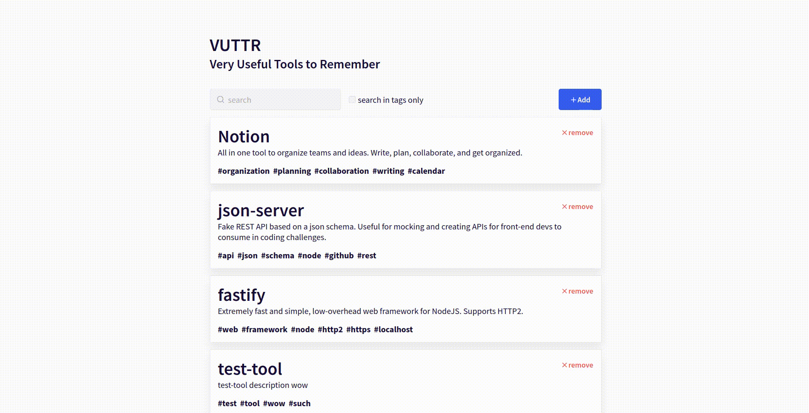

# VUTTR - Very Useful Tools To Remmember
> This project was made for the [Bossabox's](https://bossabox.com/) *Frontend* [challenge](https://www.notion.so/Front-end-c12adcdbe7a1425dbfbcd5a397b4ff10)

  <a href="#rocket-why">Why</a>&nbsp;&nbsp;&nbsp;|&nbsp;&nbsp;&nbsp;
  <a href="#package-used-technologies">Used technologies</a>&nbsp;&nbsp;&nbsp;|&nbsp;&nbsp;&nbsp;
  <a href="#computer-getting-started">Getting started</a>&nbsp;&nbsp;&nbsp;|&nbsp;&nbsp;&nbsp;

  

## :rocket: Why

I've decided to work on this challenge as a way to go for a *hands-on*  on a "real world" project.

## :package: Used technologies

This application was built using `npx create-react-app` with the `--template=typescript` flag to set the *Typescript* stuff.

* [axios](https://github.com/axios/axios): Promise based HTTP client for the browser and node.js
* [styled-components](https://github.com/styled-components/styled-components): Visual primitives for the component age. Use the best bits of ES6 and CSS to style your apps without stress :nail_care:
* [polished](https://github.com/styled-components/polished): A lightweight toolset for writing styles in JavaScript
* [react-icons](https://github.com/react-icons/react-icons): SVG react icons of popular icon packs
* [React Hooks](https://reactjs.org/docs/hooks-intro.html): Using state and other React features without writing a class
* [unform](https://unform.dev/): Unform is a performance focused library that helps you creating beautiful forms in React with the power of uncontrolled components performance and React Hooks.

## :computer: Getting started

Clone the [backend](https://gitlab.com/bossabox/challenge-fake-api/tree/master) and follow its steps to get it ready and running and then proceed to this repository steps.

- Clone this repository
- Run `yarn` in the root folder to install all needed dependencies and get ready to use this app.
- After that, you just need to run `yarn start` *et voilà!* You're ready to play this app.

### Todo:
- Add tool form
  - Add form validation
  - Change description input to `<textarea />` instead of `input`
  - Add loading indicator on form submit
- Remove tool modal
  - Add loading indicator on confirm remove
- Enhancements
  - Replace the icon on search input with a loading indicator when querying
  - Add debounce on search input and tags only checkbox

Made with 💜 by [Pedro Fagundes](https://github.com/pedrofagundes)
